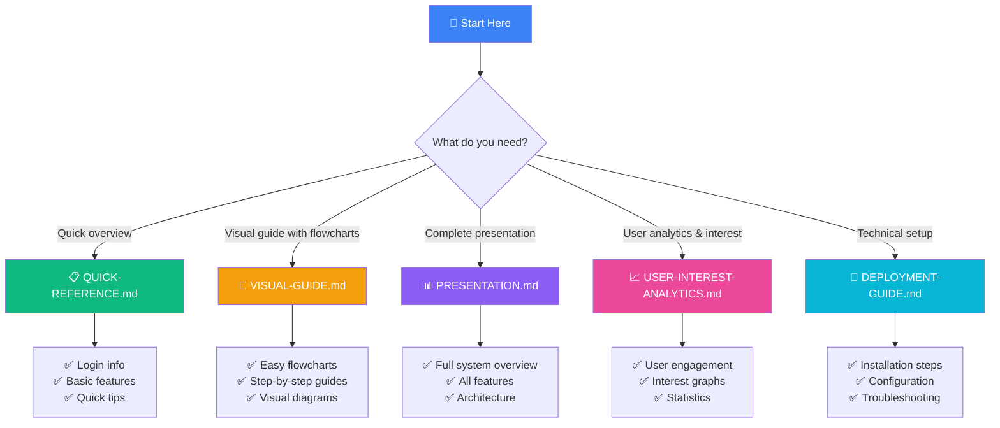
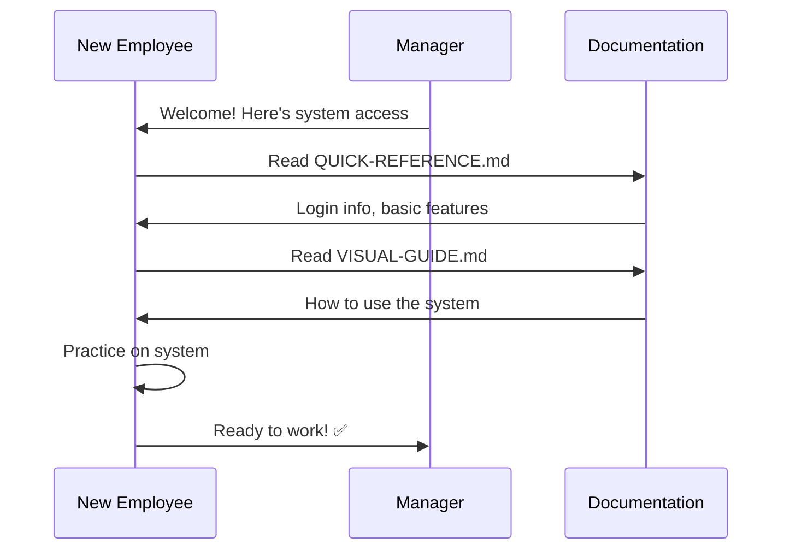
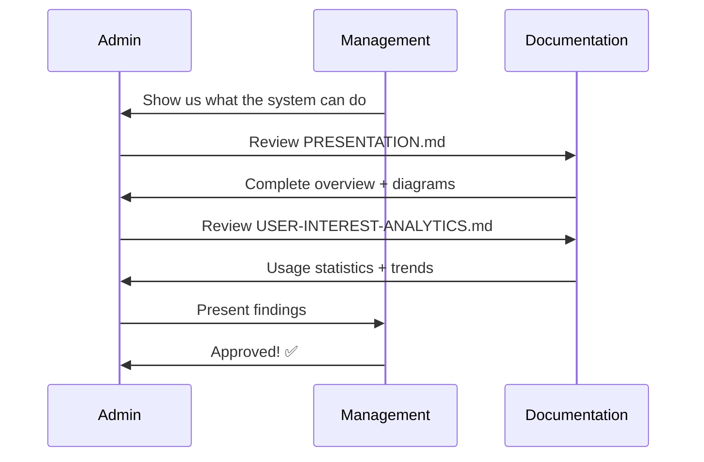
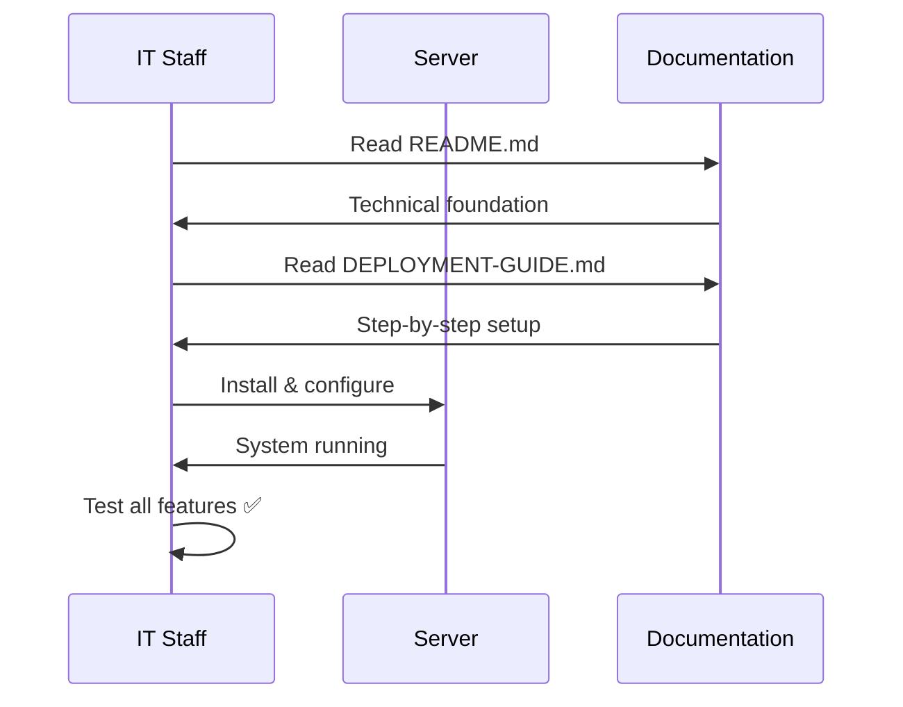
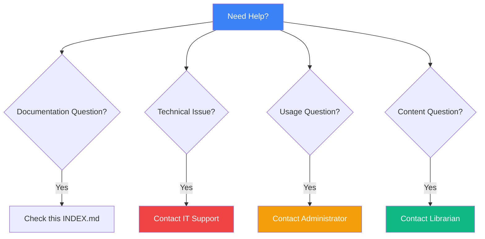

# 📚 Digital Library System - Complete Documentation Index

Welcome to the **Digital Library Management System** documentation! This index helps you find the right document for your needs.

---

## 🎯 Quick Start - Which Document Should I Read?

---

## 📖 Complete Documentation Library

### 🌟 For End Users

#### 1. 📋 [QUICK-REFERENCE.md](QUICK-REFERENCE.md)
**Best for:** Quick answers and daily use

**Contents:**
- ✅ Login credentials
- ✅ Quick access links
- ✅ Feature overview
- ✅ Keyboard shortcuts
- ✅ Common troubleshooting
- ✅ Printable cheat sheet

**Read this when:** 
- You need quick information
- First time logging in
- Looking for help desk info
- Want a printable reference card

---

#### 2. 🎨 [VISUAL-GUIDE.md](VISUAL-GUIDE.md)
**Best for:** Learning how to use the system

**Contents:**
- ✅ Easy-to-understand flowcharts
- ✅ User workflow diagrams
- ✅ Admin workflow diagrams
- ✅ Step-by-step visual guides
- ✅ ASCII art UI mockups
- ✅ Troubleshooting flowcharts

**Read this when:**
- You prefer visual learning
- Want to understand workflows
- Learning the system for first time
- Need to train new users

---

### 🎯 For Managers & Stakeholders

#### 3. 📊 [PRESENTATION.md](PRESENTATION.md)
**Best for:** Complete system overview and presentations

**Contents:**
- ✅ Comprehensive system overview
- ✅ All features with Mermaid diagrams
- ✅ User and admin workflows
- ✅ Dashboard analytics explanation
- ✅ System architecture
- ✅ Role-based access control
- ✅ Deployment workflow
- ✅ Technology stack details

**Read this when:**
- Presenting to management
- Need complete system understanding
- Planning deployments
- Evaluating the system
- Creating training materials

---

#### 4. 📈 [USER-INTEREST-ANALYTICS.md](USER-INTEREST-ANALYTICS.md)
**Best for:** Understanding user engagement and interests

**Contents:**
- ✅ User engagement trends
- ✅ Popular category analysis
- ✅ Activity pattern graphs
- ✅ Search behavior analytics
- ✅ Reading time metrics
- ✅ Growth projections
- ✅ Recommendations based on data

**Read this when:**
- Analyzing system usage
- Planning content strategy
- Reporting to management
- Understanding user needs
- Making improvement decisions

---

### 🔧 For IT & System Administrators

#### 5. 🚀 [DEPLOYMENT-GUIDE.md](DEPLOYMENT-GUIDE.md)
**Best for:** Setting up and deploying the system

**Contents:**
- ✅ Complete installation steps
- ✅ Database setup instructions
- ✅ Server configuration
- ✅ Network deployment
- ✅ Environment setup
- ✅ Technical troubleshooting

**Read this when:**
- Installing the system
- Setting up server
- Configuring database
- Deploying on network
- Fixing technical issues

---

#### 6. 📘 [README-DEPLOYMENT.md](README-DEPLOYMENT.md)
**Best for:** Quick deployment checklist

**Contents:**
- ✅ Quick start steps
- ✅ What's new & improved
- ✅ Chart details
- ✅ Database requirements
- ✅ Technical specifications
- ✅ User roles overview

**Read this when:**
- Need quick deployment steps
- Want feature summary
- Checking system requirements
- Understanding capabilities

---

#### 7. 📗 [README.md](README.md)
**Best for:** Technical documentation and setup

**Contents:**
- ✅ Prerequisites
- ✅ Installation steps
- ✅ Project structure
- ✅ Database schema
- ✅ PDF file management
- ✅ LAN network access
- ✅ Available scripts

**Read this when:**
- First-time setup
- Understanding code structure
- Managing PDF files
- Configuring network access

---

## 🎓 Learning Path by Role

### For Regular Users

**Recommended Reading Order:**
1. **QUICK-REFERENCE.md** - Get login info and basics (10 min)
2. **VISUAL-GUIDE.md** - Understand how to use features (20 min)
3. **Start exploring the system!** 🎉

---

### For Library Staff / Petugas

**Recommended Reading Order:**
1. **QUICK-REFERENCE.md** - Learn basics (10 min)
2. **VISUAL-GUIDE.md** - See admin workflows (30 min)
3. **PRESENTATION.md** - Deep dive into admin features (45 min)
4. **Practice on the system!** 🎉

---

### For Administrators

**Recommended Reading Order:**
1. **PRESENTATION.md** - Complete system overview (60 min)
2. **USER-INTEREST-ANALYTICS.md** - Understand user behavior (30 min)
3. **DEPLOYMENT-GUIDE.md** - Technical setup (45 min)
4. **Manage the entire system!** 🎉

---

### For IT Support

**Recommended Reading Order:**
1. **README.md** - Technical foundation (30 min)
2. **DEPLOYMENT-GUIDE.md** - Setup procedures (60 min)
3. **PRESENTATION.md** - System architecture section (30 min)
4. **Deploy and maintain!** 🎉

---

## 📊 Document Comparison Matrix

| Document | Target Audience | Length | Diagrams | Technical Level |
|----------|----------------|--------|----------|-----------------|
| **QUICK-REFERENCE.md** | All Users | Short (2-3 pages) | Basic | ⭐ Beginner |
| **VISUAL-GUIDE.md** | End Users | Medium (15-20 pages) | Many | ⭐⭐ Easy |
| **PRESENTATION.md** | Stakeholders | Long (25-30 pages) | Many | ⭐⭐⭐ Intermediate |
| **USER-INTEREST-ANALYTICS.md** | Managers | Medium (10-15 pages) | Charts | ⭐⭐ Easy |
| **DEPLOYMENT-GUIDE.md** | IT Staff | Long (20-25 pages) | Some | ⭐⭐⭐⭐ Advanced |
| **README-DEPLOYMENT.md** | IT Staff | Short (3-5 pages) | Few | ⭐⭐⭐ Intermediate |
| **README.md** | Developers | Medium (10-15 pages) | Few | ⭐⭐⭐⭐ Advanced |

---

## 🎯 Use Case Scenarios

### Scenario 1: New Employee Onboarding

**Documents Needed:**
1. QUICK-REFERENCE.md
2. VISUAL-GUIDE.md

---

### Scenario 2: Management Presentation

**Documents Needed:**
1. PRESENTATION.md
2. USER-INTEREST-ANALYTICS.md

---

### Scenario 3: System Deployment

**Documents Needed:**
1. README.md
2. DEPLOYMENT-GUIDE.md
3. README-DEPLOYMENT.md

---

## 💡 Quick Find - Common Questions

| Question | Document to Read | Section |
|----------|------------------|---------|
| "How do I login?" | QUICK-REFERENCE.md | Login Credentials |
| "What can regular users do?" | VISUAL-GUIDE.md | User Workflows |
| "How do I add a book?" | VISUAL-GUIDE.md | Admin Workflows |
| "What are the charts?" | PRESENTATION.md | Dashboard Analytics |
| "How many users are active?" | USER-INTEREST-ANALYTICS.md | Engagement Metrics |
| "How do I install the system?" | DEPLOYMENT-GUIDE.md | Deployment Steps |
| "What are peak usage hours?" | USER-INTEREST-ANALYTICS.md | Activity Patterns |
| "What's the system architecture?" | PRESENTATION.md | System Architecture |

---

## 📱 Documentation Formats

All documents are available in **Markdown format** with:

- ✅ **Mermaid Diagrams** - Interactive flowcharts and graphs
- ✅ **Tables** - Easy-to-read data presentation
- ✅ **Emoji Icons** - Visual clarity and engagement
- ✅ **Code Blocks** - Technical examples
- ✅ **Links** - Easy navigation

### How to View:
- **GitHub**: Automatically renders Mermaid diagrams
- **VS Code**: Install "Markdown Preview Mermaid Support" extension
- **Online**: Use any Markdown + Mermaid viewer
- **Print**: Most viewers support PDF export

---

## 🆘 Getting Help

### If You Can't Find What You Need:

---

## 🎉 Summary

This Digital Library Management System has **complete, professional documentation** covering:

- ✅ **User Guides** - Easy-to-follow instructions for all users
- ✅ **Visual Diagrams** - Flowcharts and graphs for better understanding
- ✅ **Analytics Reports** - Data-driven insights on user engagement
- ✅ **Technical Docs** - Complete setup and architecture information
- ✅ **Quick References** - Fast answers to common questions

**Everything you need to successfully deploy, manage, and use the system!** 🚀

---

## 📋 Documentation Checklist

Use this to verify you have access to all documents:

- [ ] ✅ QUICK-REFERENCE.md
- [ ] ✅ VISUAL-GUIDE.md
- [ ] ✅ PRESENTATION.md
- [ ] ✅ USER-INTEREST-ANALYTICS.md
- [ ] ✅ DEPLOYMENT-GUIDE.md
- [ ] ✅ README-DEPLOYMENT.md
- [ ] ✅ README.md
- [ ] ✅ INDEX.md (this file)

---

**Happy Reading! 📚✨**

*Documentation Index Version: 1.0*  
*Last Updated: 2025*  
*Digital Library Management System*
