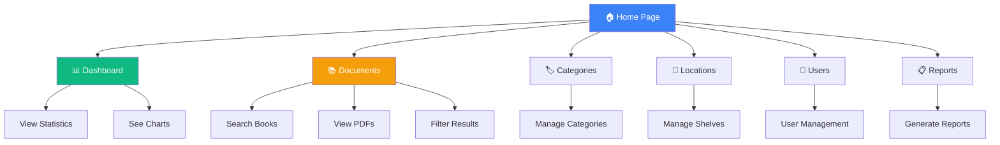
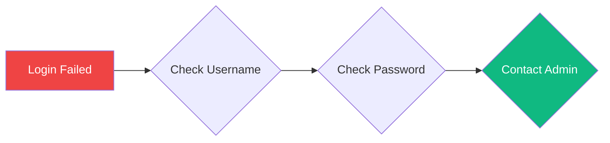
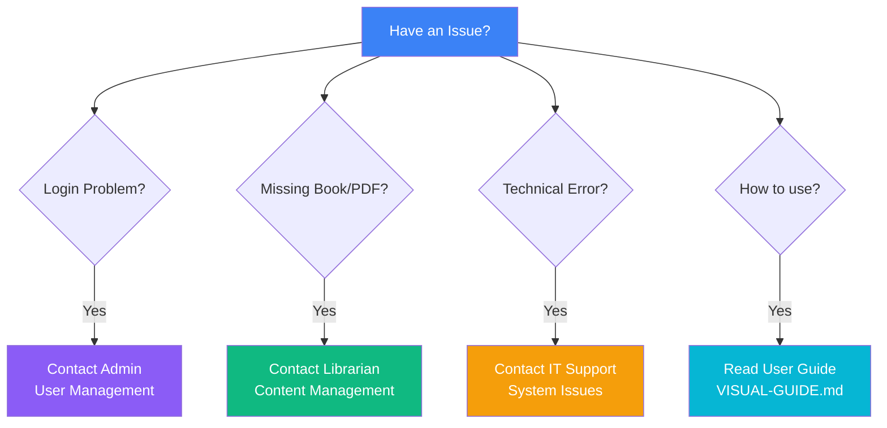
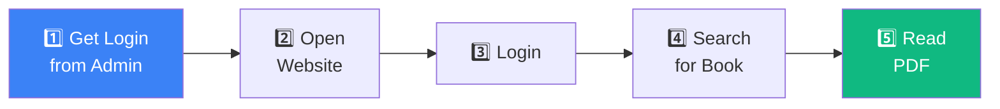
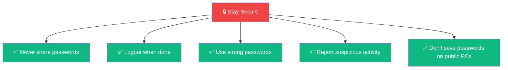
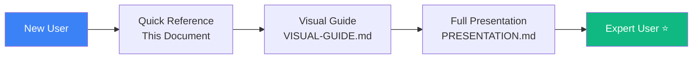

# 📊 Library System - Quick Reference Card

---

## 🚀 Access Information

| Item | Details |
|------|---------|
| 🌐 **Local URL** | `http://localhost:5000` |
| 🌐 **Network URL** | `http://[SERVER-IP]:5000` |
| 📧 **Support** | Contact your system administrator |

---

## 🔐 Default Login Credentials

### Admin Access
```
Username: admin
Password: admin123
Access: Full system control
```

### Petugas (Staff) Access
```
Username: petugas
Password: petugas123
Access: Book management only
```

### Regular User Access
```
Username: user
Password: user123
Access: Browse and read only
```

---

## 📚 Main Features Quick Access



---

## 🎯 User Roles & Permissions

### What Each Role Can Do

| Feature | Admin | Petugas | User |
|---------|:-----:|:-------:|:----:|
| 📊 View Dashboard | ✅ Full | ✅ Full | ✅ Limited |
| 📚 Browse Books | ✅ | ✅ | ✅ |
| 🔍 Search | ✅ | ✅ | ✅ |
| 📄 View PDFs | ✅ | ✅ | ✅ |
| ➕ Add Books | ✅ | ✅ | ❌ |
| ✏️ Edit Books | ✅ | ✅ | ❌ |
| 🗑️ Delete Books | ✅ | ✅ | ❌ |
| 🏷️ Manage Categories | ✅ | ✅ | ❌ |
| 📍 Manage Locations | ✅ | ✅ | ❌ |
| 👥 Manage Users | ✅ | ❌ | ❌ |
| 📋 Generate Reports | ✅ | ❌ | ❌ |

---

## 📈 Dashboard Charts Explained

### Chart 1: Collection Status 🍩
- **Type:** Doughnut (Pie) Chart
- **Shows:** Available vs On Loan books
- **Colors:** Green (Available), Orange (On Loan)

### Chart 2: Top Categories 📊
- **Type:** Vertical Bar Chart
- **Shows:** Number of books per category
- **Sorted:** Highest to lowest

### Chart 3: User Activity 👥
- **Type:** Line Chart
- **Shows:** Active users per month (6 months)
- **Trend:** Shows growth or decline

### Chart 4: Books by Category 📚
- **Type:** Horizontal Bar Chart
- **Shows:** Recently added books (8 weeks)
- **Purpose:** Track collection growth

---

## 🔍 How to Search for Books

### Search Box
```
┌─────────────────────────────────┐
│ 🔍 Search books...              │
└─────────────────────────────────┘
```
**Type:** Title, Author, or Keywords

### Filters
```
Category: [All Categories ▼]
Location: [All Locations ▼]
```

### Quick Search Tips
- ✅ Use specific book titles
- ✅ Try author names
- ✅ Use category filters to narrow results
- ✅ Combine search with filters for best results

---

## 📖 Reading PDF Documents

### Step-by-Step
1. **Find Book** → Search or browse
2. **Click Title** → View book details
3. **Click "Open PDF"** → Viewer opens
4. **Navigate** → Use arrows or page numbers

### PDF Viewer Controls
```
[◀ Previous]  Page 1 of 250  [Next ▶]
             [🔍-] Zoom [🔍+]
```

---

## ⚡ Keyboard Shortcuts

| Key | Action |
|-----|--------|
| `Ctrl + F` | Open search |
| `Enter` | Submit search |
| `Esc` | Close dialogs |
| `Tab` | Navigate fields |
| `Arrow Keys` | Navigate PDF pages |

---

## 🆘 Common Issues & Solutions

### Cannot Login?


**Solutions:**
1. ✅ Verify username spelling
2. ✅ Check CAPS LOCK is off
3. ✅ Try password reset
4. ✅ Contact system administrator

### PDF Not Opening?
**Solutions:**
1. ✅ Check internet connection
2. ✅ Try different browser
3. ✅ Clear browser cache
4. ✅ Reload the page
5. ✅ Contact librarian if file is missing

### Slow Performance?
**Solutions:**
1. ✅ Close unused browser tabs
2. ✅ Check network connection
3. ✅ Clear browser cache and cookies
4. ✅ Try during off-peak hours

---

## 📱 Supported Browsers

| Browser | Supported | Recommended Version |
|---------|-----------|---------------------|
| 🌐 Chrome | ✅ Yes | Latest |
| 🦊 Firefox | ✅ Yes | Latest |
| 🔷 Edge | ✅ Yes | Latest |
| 🧭 Safari | ✅ Yes | Latest |
| 🌐 IE 11 | ❌ No | Not supported |

---

## 📞 Support & Help

### Who to Contact



### Before Contacting Support
- ✅ Try reloading the page
- ✅ Check your internet connection
- ✅ Clear browser cache
- ✅ Note any error messages
- ✅ Try a different browser

---

## 🎯 Quick Start Guide

### For First-Time Users



### Your First 5 Minutes
1. **Login** with your credentials
2. **Explore Dashboard** to see statistics
3. **Click "Document Repository"** in the sidebar
4. **Try Searching** for a topic you're interested in
5. **Open a PDF** and start reading!

---

## 📊 System Statistics

### Current Library Collection
```
📚 Total Books:        17,000+
✅ Available:          92.6%
📤 On Loan:            7.4%
🏷️ Categories:         24
📍 Locations:          Multiple shelves
👥 Active Users:       105+ monthly
```

### Usage Trends
```
📈 User Growth:        +14% monthly
📊 Document Views:     +8% monthly
🔍 Searches:           +10% monthly
⏱️ Avg Session:        12.5 minutes
```

---

## 💡 Pro Tips

### For Users
```
✨ Save time by using category filters
✨ Bookmark frequently used books
✨ Use specific search terms for better results
✨ Check "Available" status before planning visits
```

### For Admins
```
✨ Add books during off-peak hours
✨ Use consistent naming conventions
✨ Regularly review user activity charts
✨ Back up the database weekly
```

---

## 🔒 Security Reminders



---

## 📅 Maintenance Schedule

| Task | Frequency | Responsible |
|------|-----------|-------------|
| 💾 Database Backup | Daily | IT Admin |
| 🔄 System Updates | Monthly | IT Admin |
| 📊 Data Cleanup | Quarterly | Librarian |
| 🔐 Password Audit | Quarterly | Admin |
| 📈 Performance Review | Monthly | IT Admin |

---

## 📖 Additional Resources

### Documentation Files
- 📘 **PRESENTATION.md** - Complete system overview
- 📗 **VISUAL-GUIDE.md** - Easy-to-understand guide
- 📕 **DEPLOYMENT-GUIDE.md** - Setup instructions
- 📙 **README.md** - Technical documentation

### Learning Path


---

## 🎉 You're Ready!

### Remember These Key Points
1. 🔐 **Keep your credentials secure**
2. 🔍 **Use search and filters effectively**
3. 📱 **Access from any device on the network**
4. 💬 **Ask for help when needed**
5. ⭐ **Enjoy the vast library collection!**

---

**Happy Reading! 📚✨**

---

*Quick Reference Card v1.0*  
*Last Updated: 2025*  
*Digital Library Management System*

---

## 📋 Printable Cheat Sheet

### Most Important Information

```
┌────────────────────────────────────────────┐
│     DIGITAL LIBRARY QUICK REFERENCE         │
├────────────────────────────────────────────┤
│                                             │
│  🌐 URL: http://[server-ip]:5000           │
│                                             │
│  🔐 LOGIN:                                  │
│     User: your_username                     │
│     Pass: your_password                     │
│                                             │
│  📚 FEATURES:                               │
│     ✅ Search 17,000+ books                │
│     ✅ Read PDFs in browser                │
│     ✅ Filter by category                  │
│     ✅ View statistics                     │
│                                             │
│  🆘 SUPPORT:                                │
│     Contact your administrator              │
│                                             │
│  💡 TIP:                                    │
│     Use specific search terms for           │
│     better results!                         │
│                                             │
└────────────────────────────────────────────┘
```

---

*Print this page and keep it handy!*
