# 🎨 Digital Library System - Visual Guide
## Easy-to-Understand Flowcharts & Diagrams

---

## 📊 Quick Navigation

- [🎯 System at a Glance](#system-at-a-glance)
- [👤 How Users Interact](#how-users-interact)
- [👨‍💼 How Admins Work](#how-admins-work)
- [📈 Understanding the Charts](#understanding-the-charts)
- [🌐 How the System Works](#how-the-system-works)

---

## 🎯 System at a Glance

### What Does This System Do?

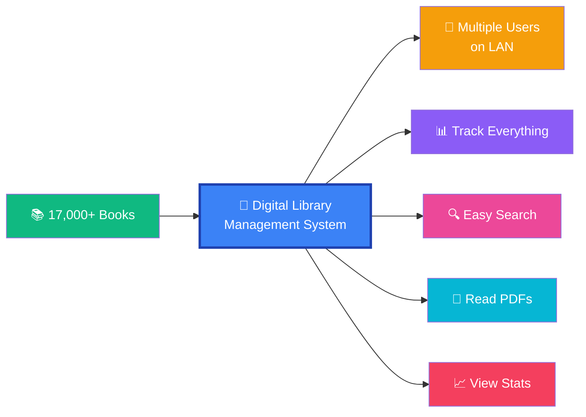
```mermaid
graph LR
    A[📚 17,000+ Books] --> B[💾 Digital Library<br/>Management System]
    B --> C[👥 Multiple Users<br/>on LAN]
    
    B --> D[📊 Track Everything]
    B --> E[🔍 Easy Search]
    B --> F[📄 Read PDFs]
    B --> G[📈 View Stats]
    
    style B fill:#3b82f6,color:#fff,stroke:#1e40af,stroke-width:3px
    style A fill:#10b981,color:#fff
    style C fill:#f59e0b,color:#fff
    style D fill:#8b5cf6,color:#fff
    style E fill:#ec4899,color:#fff
    style F fill:#06b6d4,color:#fff
    style G fill:#f43f5e,color:#fff
```

### Three Types of Users

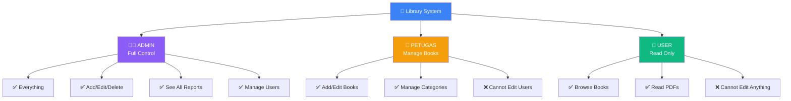
```mermaid
graph TD
    System[🏢 Library System]
    
    System --> Admin[👨‍💼 ADMIN<br/>Full Control]
    System --> Petugas[👷 PETUGAS<br/>Manage Books]
    System --> User[👤 USER<br/>Read Only]
    
    Admin --> A1[✅ Everything]
    Admin --> A2[✅ Add/Edit/Delete]
    Admin --> A3[✅ See All Reports]
    Admin --> A4[✅ Manage Users]
    
    Petugas --> P1[✅ Add/Edit Books]
    Petugas --> P2[✅ Manage Categories]
    Petugas --> P3[❌ Cannot Edit Users]
    
    User --> U1[✅ Browse Books]
    User --> U2[✅ Read PDFs]
    User --> U3[❌ Cannot Edit Anything]
    
    style System fill:#3b82f6,color:#fff
    style Admin fill:#8b5cf6,color:#fff
    style Petugas fill:#f59e0b,color:#fff
    style User fill:#10b981,color:#fff
```

---

## 👤 How Users Interact

### Step-by-Step: What a Regular User Does

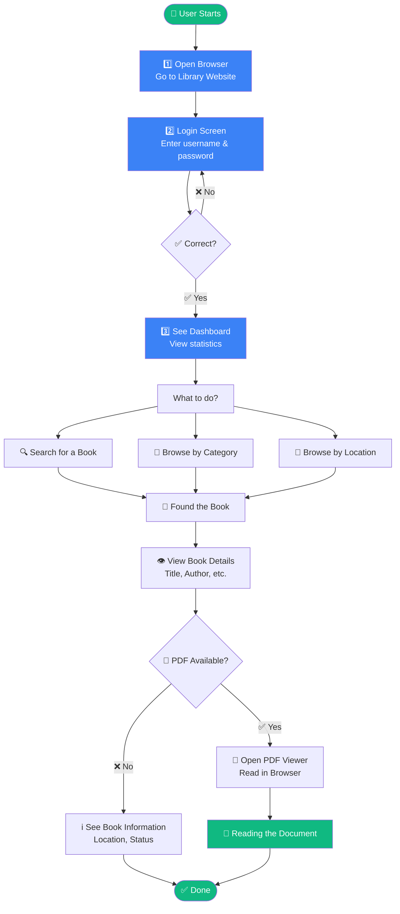
```mermaid
graph TB
    Start([👤 User Starts]) --> Step1[1️⃣ Open Browser<br/>Go to Library Website]
    
    Step1 --> Step2[2️⃣ Login Screen<br/>Enter username & password]
    
    Step2 --> Check1{✅ Correct?}
    Check1 -->|❌ No| Step2
    Check1 -->|✅ Yes| Step3[3️⃣ See Dashboard<br/>View statistics]
    
    Step3 --> Choice[What to do?]
    
    Choice --> Option1[🔍 Search for a Book]
    Choice --> Option2[📂 Browse by Category]
    Choice --> Option3[📍 Browse by Location]
    
    Option1 --> Find[📖 Found the Book]
    Option2 --> Find
    Option3 --> Find
    
    Find --> View[👁️ View Book Details<br/>Title, Author, etc.]
    
    View --> Check2{📄 PDF Available?}
    Check2 -->|✅ Yes| Open[📱 Open PDF Viewer<br/>Read in Browser]
    Check2 -->|❌ No| Info[ℹ️ See Book Information<br/>Location, Status]
    
    Open --> Read[📖 Reading the Document]
    Info --> Done
    Read --> Done([✅ Done])
    
    style Start fill:#10b981,color:#fff
    style Step1 fill:#3b82f6,color:#fff
    style Step2 fill:#3b82f6,color:#fff
    style Step3 fill:#3b82f6,color:#fff
    style Read fill:#10b981,color:#fff
    style Done fill:#10b981,color:#fff
```

### User's Main Features

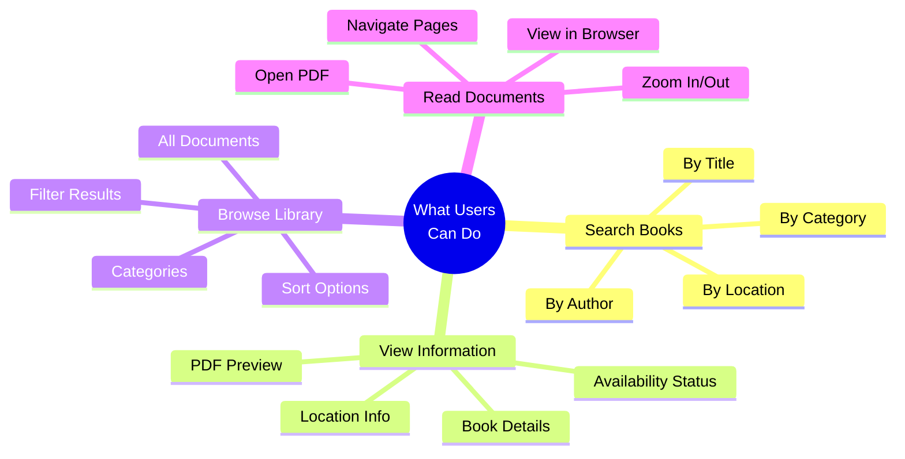
```mermaid
mindmap
  root((What Users<br/>Can Do))
    Search Books
      By Title
      By Author
      By Category
      By Location
    View Information
      Book Details
      PDF Preview
      Availability Status
      Location Info
    Browse Library
      All Documents
      Filter Results
      Sort Options
      Categories
    Read Documents
      Open PDF
      View in Browser
      Navigate Pages
      Zoom In/Out
```

---

## 👨‍💼 How Admins Work

### Complete Admin Workflow

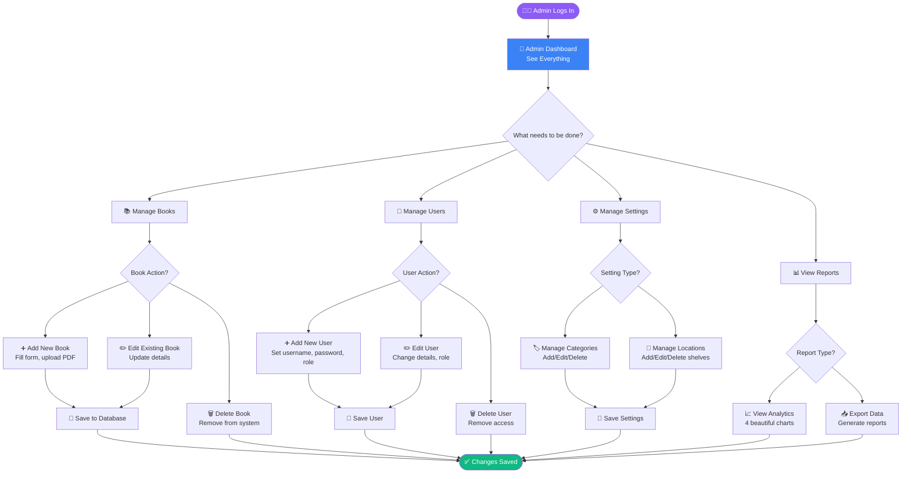
```mermaid
graph TB
    AdminStart([👨‍💼 Admin Logs In]) --> Dashboard[🎯 Admin Dashboard<br/>See Everything]
    
    Dashboard --> MainChoice{What needs to be done?}
    
    MainChoice --> Books[📚 Manage Books]
    MainChoice --> Users[👥 Manage Users]
    MainChoice --> Settings[⚙️ Manage Settings]
    MainChoice --> Reports[📊 View Reports]
    
    Books --> BookChoice{Book Action?}
    BookChoice --> AddBook[➕ Add New Book<br/>Fill form, upload PDF]
    BookChoice --> EditBook[✏️ Edit Existing Book<br/>Update details]
    BookChoice --> DeleteBook[🗑️ Delete Book<br/>Remove from system]
    
    Users --> UserChoice{User Action?}
    UserChoice --> AddUser[➕ Add New User<br/>Set username, password, role]
    UserChoice --> EditUser[✏️ Edit User<br/>Change details, role]
    UserChoice --> DeleteUser[🗑️ Delete User<br/>Remove access]
    
    Settings --> SettingChoice{Setting Type?}
    SettingChoice --> Categories[🏷️ Manage Categories<br/>Add/Edit/Delete]
    SettingChoice --> Locations[📍 Manage Locations<br/>Add/Edit/Delete shelves]
    
    Reports --> ReportChoice{Report Type?}
    ReportChoice --> ViewCharts[📈 View Analytics<br/>4 beautiful charts]
    ReportChoice --> Export[📥 Export Data<br/>Generate reports]
    
    AddBook --> Save1[💾 Save to Database]
    EditBook --> Save1
    AddUser --> Save2[💾 Save User]
    EditUser --> Save2
    Categories --> Save3[💾 Save Settings]
    Locations --> Save3
    
    Save1 --> Success([✅ Changes Saved])
    Save2 --> Success
    Save3 --> Success
    DeleteBook --> Success
    DeleteUser --> Success
    ViewCharts --> Success
    Export --> Success
    
    style AdminStart fill:#8b5cf6,color:#fff
    style Dashboard fill:#3b82f6,color:#fff
    style Success fill:#10b981,color:#fff
```

### Admin Dashboard - What They See


```mermaid
graph TB
    subgraph Dashboard["🎯 ADMIN DASHBOARD VIEW"]
        subgraph Stats["📊 Quick Statistics (Top Cards)"]
            S1[📚 Total Books<br/>17,000]
            S2[✅ Available<br/>15,750]
            S3[📤 On Loan<br/>1,250]
            S4[🏷️ Categories<br/>24]
        end
        
        subgraph Charts["📈 Four Analytics Charts"]
            C1[🍩 Collection Status<br/>Doughnut Chart]
            C2[📊 Top Categories<br/>Bar Chart]
            C3[👥 User Activity<br/>Line Chart]
            C4[📚 Books Added<br/>Bar Chart]
        end
        
        subgraph Actions["⚡ Quick Actions"]
            A1[➕ Add Book]
            A2[👥 Manage Users]
            A3[📋 View Reports]
            A4[⚙️ Settings]
        end
    end
    
    Stats --> Charts
    Charts --> Actions
    
    style Dashboard fill:#f8fafc,stroke:#3b82f6,stroke-width:2px
    style Stats fill:#dbeafe
    style Charts fill:#fef3c7
    style Actions fill:#dcfce7
```

---

## 📈 Understanding the Charts

### Chart 1: Collection Status (Doughnut)

**What it looks like:**

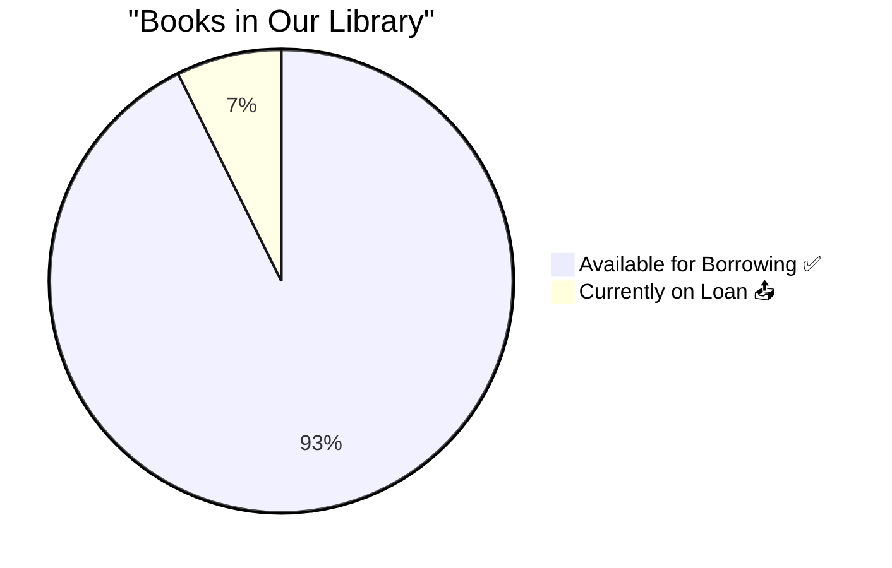
```mermaid
pie title "Books in Our Library"
    "Available for Borrowing ✅" : 15750
    "Currently on Loan 📤" : 1250
```

**What it tells you:**
- ✅ Green part = Books you can borrow right now
- 🟡 Yellow part = Books someone else is reading
- 🎯 Quick view of library availability

---

### Chart 2: Top Categories (Bar)

**What it looks like:**

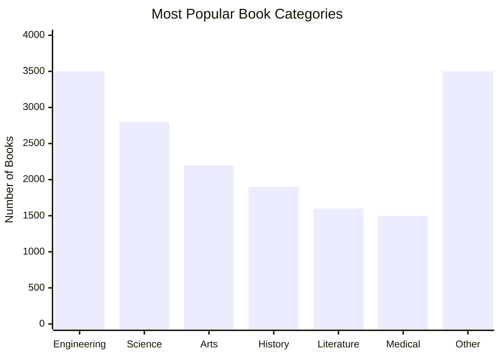
```mermaid
xychart-beta
    title "Most Popular Book Categories"
    x-axis [Engineering, Science, Arts, History, Literature, Medical, Other]
    y-axis "Number of Books" 0 --> 4000
    bar [3500, 2800, 2200, 1900, 1600, 1500, 3500]
```

**What it tells you:**
- 📊 Which categories have the most books
- 📚 What type of library this is
- 🎯 Collection strengths and focus areas

---

### Chart 3: Monthly User Activity (Line)

**What it looks like:**

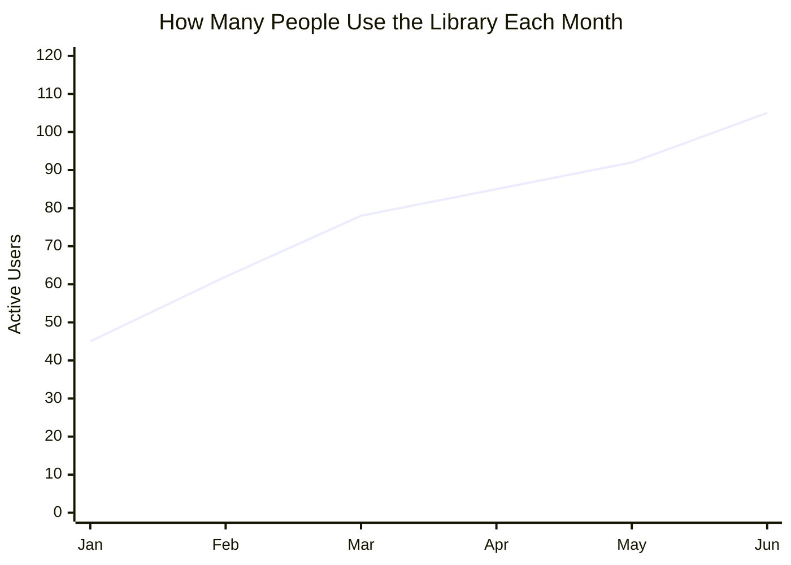
```mermaid
xychart-beta
    title "How Many People Use the Library Each Month"
    x-axis [Jan, Feb, Mar, Apr, May, Jun]
    y-axis "Active Users" 0 --> 120
    line [45, 62, 78, 85, 92, 105]
```

**What it tells you:**
- 👥 How library usage is growing
- 📈 Trend: Going up = More people using it
- 📅 Peak months vs slow months
- 🎯 Library popularity over time

**Real Example:**
- January: 45 people used the library
- June: 105 people used the library
- **Result:** Usage increased by 133%! 🎉

---

### Chart 4: Books Added by Category (Bar)

**What it looks like:**

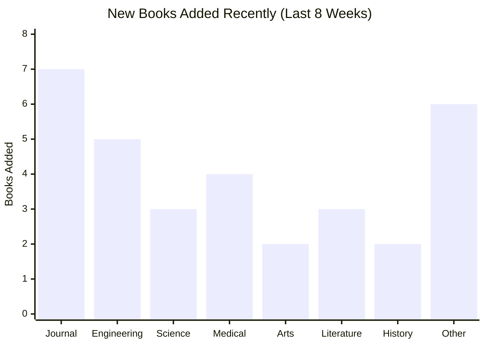
```mermaid
xychart-beta
    title "New Books Added Recently (Last 8 Weeks)"
    x-axis [Journal, Engineering, Science, Medical, Arts, Literature, History, Other]
    y-axis "Books Added" 0 --> 8
    bar [7, 5, 3, 4, 2, 3, 2, 6]
```

**What it tells you:**
- 📚 Which categories are growing
- 👨‍💼 What admins are adding to the library
- 📈 Recent collection development
- 🎯 Focus areas for new acquisitions

---

## 🌐 How the System Works

### Complete System Flow

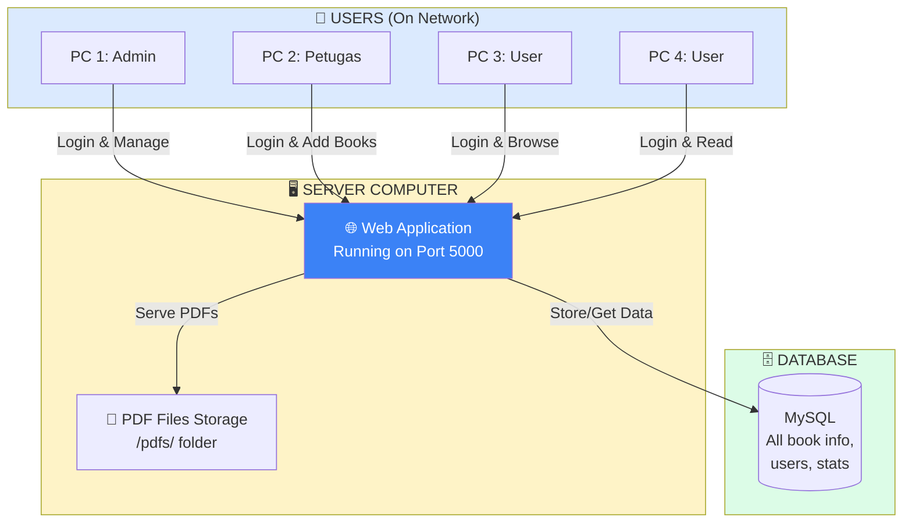
```mermaid
graph TB
    subgraph Users["👥 USERS (On Network)"]
        U1[PC 1: Admin]
        U2[PC 2: Petugas]
        U3[PC 3: User]
        U4[PC 4: User]
    end
    
    subgraph Server["🖥️ SERVER COMPUTER"]
        Web[🌐 Web Application<br/>Running on Port 5000]
        Files[📁 PDF Files Storage<br/>/pdfs/ folder]
    end
    
    subgraph Database["🗄️ DATABASE"]
        DB[(MySQL<br/>All book info,<br/>users, stats)]
    end
    
    U1 -->|Login & Manage| Web
    U2 -->|Login & Add Books| Web
    U3 -->|Login & Browse| Web
    U4 -->|Login & Read| Web
    
    Web -->|Store/Get Data| DB
    Web -->|Serve PDFs| Files
    
    style Users fill:#dbeafe
    style Server fill:#fef3c7
    style Database fill:#dcfce7
    style Web fill:#3b82f6,color:#fff
```

### How Data Flows

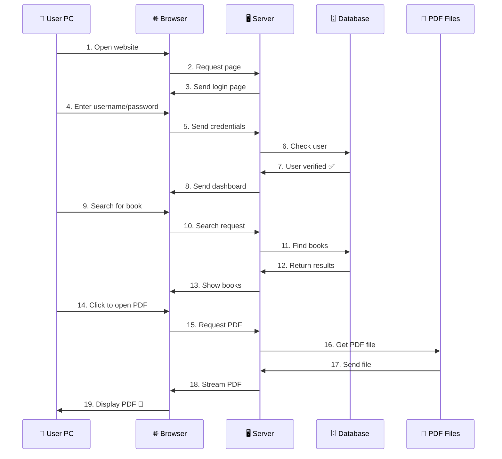
```mermaid
sequenceDiagram
    participant User as 👤 User PC
    participant Browser as 🌐 Browser
    participant Server as 🖥️ Server
    participant DB as 🗄️ Database
    participant Files as 📁 PDF Files
    
    User->>Browser: 1. Open website
    Browser->>Server: 2. Request page
    Server->>Browser: 3. Send login page
    
    User->>Browser: 4. Enter username/password
    Browser->>Server: 5. Send credentials
    Server->>DB: 6. Check user
    DB->>Server: 7. User verified ✅
    Server->>Browser: 8. Send dashboard
    
    User->>Browser: 9. Search for book
    Browser->>Server: 10. Search request
    Server->>DB: 11. Find books
    DB->>Server: 12. Return results
    Server->>Browser: 13. Show books
    
    User->>Browser: 14. Click to open PDF
    Browser->>Server: 15. Request PDF
    Server->>Files: 16. Get PDF file
    Files->>Server: 17. Send file
    Server->>Browser: 18. Stream PDF
    Browser->>User: 19. Display PDF 📄
```

---

## 🔄 Common User Scenarios

### Scenario 1: Student Looking for Engineering Book

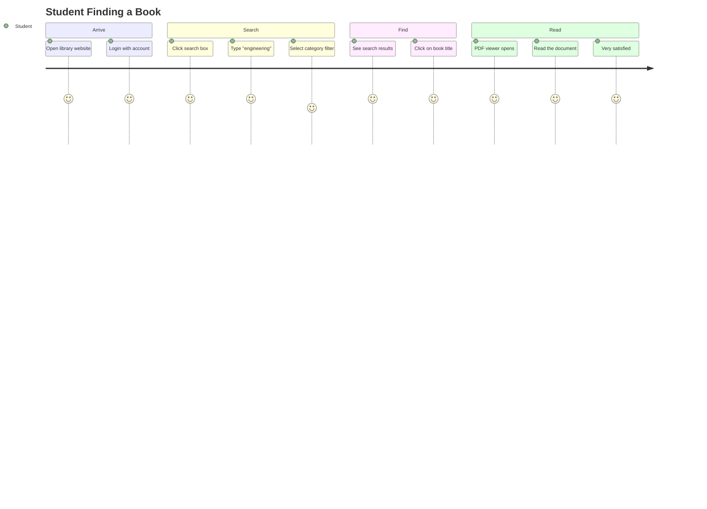
```mermaid
journey
    title Student Finding a Book
    section Arrive
      Open library website: 5: Student
      Login with account: 5: Student
    section Search
      Click search box: 5: Student
      Type "engineering": 5: Student
      Select category filter: 4: Student
    section Find
      See search results: 5: Student
      Click on book title: 5: Student
    section Read
      PDF viewer opens: 5: Student
      Read the document: 5: Student
      Very satisfied: 5: Student
```

### Scenario 2: Librarian Adding New Books

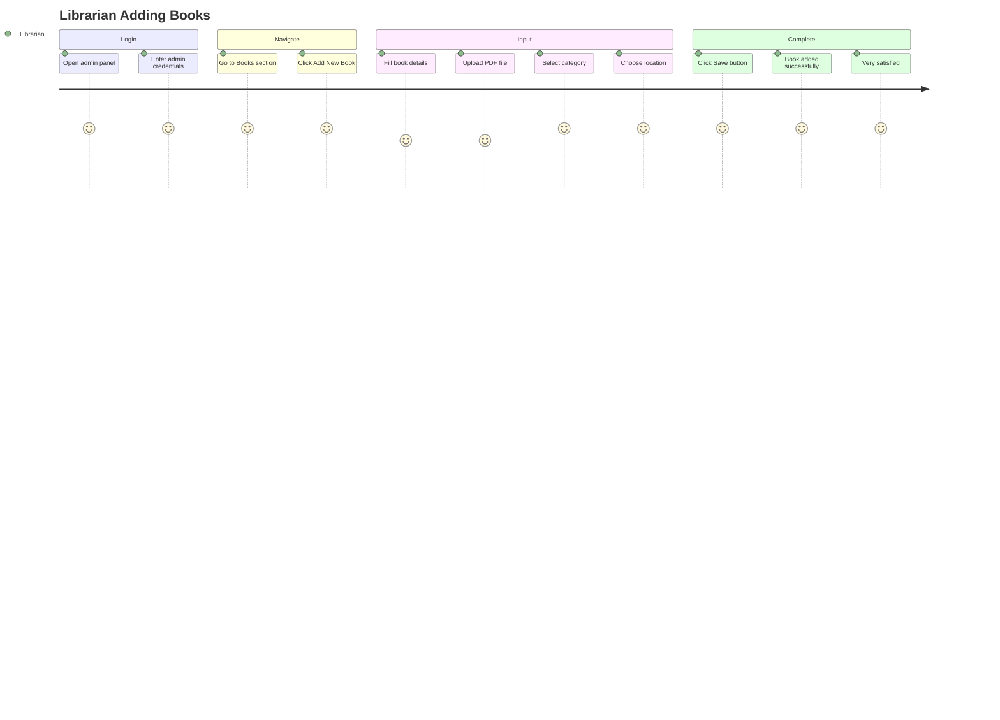
```mermaid
journey
    title Librarian Adding Books
    section Login
      Open admin panel: 5: Librarian
      Enter admin credentials: 5: Librarian
    section Navigate
      Go to Books section: 5: Librarian
      Click Add New Book: 5: Librarian
    section Input
      Fill book details: 4: Librarian
      Upload PDF file: 4: Librarian
      Select category: 5: Librarian
      Choose location: 5: Librarian
    section Complete
      Click Save button: 5: Librarian
      Book added successfully: 5: Librarian
      Very satisfied: 5: Librarian
```

---

## 📱 Using the System: Step-by-Step Pictures

### For Regular Users

#### Step 1: Login
```
┌─────────────────────────────────┐
│   📚 Library Management System  │
│                                 │
│   Username: [____________]      │
│   Password: [____________]      │
│                                 │
│         [  LOGIN  ]             │
└─────────────────────────────────┘
```

#### Step 2: Dashboard
```
┌─────────────────────────────────────────────────┐
│ 🏠 Dashboard                         👤 User    │
├─────────────────────────────────────────────────┤
│  📊 Statistics:                                 │
│  ┌──────┐ ┌──────┐ ┌──────┐ ┌──────┐         │
│  │17000 │ │15750 │ │ 1250 │ │  24  │         │
│  │Books │ │Avail │ │ Loan │ │ Cat. │         │
│  └──────┘ └──────┘ └──────┘ └──────┘         │
│                                                 │
│  📈 Charts showing usage...                    │
└─────────────────────────────────────────────────┘
```

#### Step 3: Browse Books
```
┌─────────────────────────────────────────────────┐
│ 📚 Document Repository                          │
├─────────────────────────────────────────────────┤
│  Search: [engineering______] 🔍                 │
│  Category: [All ▼] Location: [All ▼]          │
├─────────────────────────────────────────────────┤
│  Title                    | Category | Status  │
│  ──────────────────────────────────────────── │
│  📕 Engineering Basics    | Eng.     | ✅ Avail│
│  📗 Advanced Mechanics    | Eng.     | ✅ Avail│
│  📘 Thermodynamics 101    | Eng.     | 📤 Loan │
└─────────────────────────────────────────────────┘
```

#### Step 4: Read PDF
```
┌─────────────────────────────────────────────────┐
│ 📄 PDF Viewer - Engineering Basics             │
├─────────────────────────────────────────────────┤
│  [<] Page 1 of 250 [>]         [🔍-] [🔍+]    │
├─────────────────────────────────────────────────┤
│                                                 │
│     ENGINEERING BASICS                          │
│     Chapter 1: Introduction                     │
│                                                 │
│     This book covers fundamental concepts...    │
│                                                 │
└─────────────────────────────────────────────────┘
```

---

### For Administrators

#### Admin Dashboard
```
┌──────────────────────────────────────────────────────┐
│ 🎯 Admin Dashboard                    👨‍💼 Admin      │
├──────────────────────────────────────────────────────┤
│  📊 Statistics & 4 Charts:                           │
│  ┌────────┐┌────────┐┌────────┐┌────────┐          │
│  │ Total  ││Available││On Loan ││Categor.│          │
│  │ 17,000 ││ 15,750  ││ 1,250  ││   24   │          │
│  └────────┘└────────┘└────────┘└────────┘          │
│                                                      │
│  ┌──────────────┐ ┌──────────────┐                 │
│  │ 🍩 Collection│ │ 📊 Top       │                 │
│  │    Status    │ │   Categories │                 │
│  └──────────────┘ └──────────────┘                 │
│                                                      │
│  ┌──────────────┐ ┌──────────────┐                 │
│  │ 👥 User      │ │ 📚 Books by  │                 │
│  │   Activity   │ │   Category   │                 │
│  └──────────────┘ └──────────────┘                 │
│                                                      │
│  Quick Actions:                                      │
│  [➕ Add Book] [👥 Users] [📋 Reports] [⚙️ Settings]│
└──────────────────────────────────────────────────────┘
```

#### Add New Book Form
```
┌──────────────────────────────────────────────────┐
│ ➕ Add New Book                                   │
├──────────────────────────────────────────────────┤
│  Title:      [________________________]          │
│  Author:     [________________________]          │
│  Publisher:  [________________________]          │
│  Category:   [Select Category ▼      ]          │
│  Location:   [Select Shelf/Rack ▼   ]          │
│  Department: [________________________]          │
│  PDF File:   [Choose File] no file chosen       │
│                                                   │
│          [Cancel]  [💾 Save Book]               │
└──────────────────────────────────────────────────┘
```

---

## 🎯 Quick Tips for Users

### Do's ✅

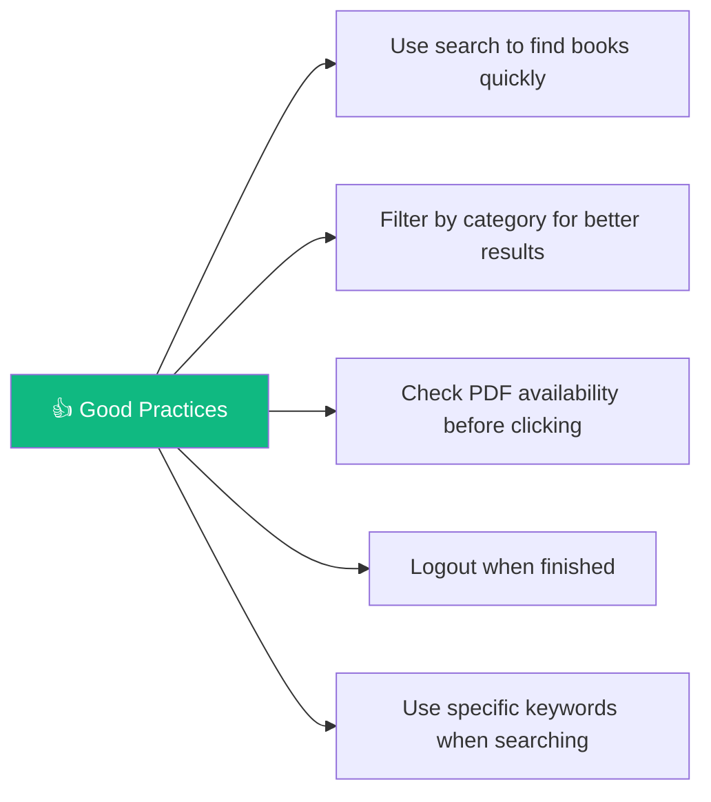
```mermaid
graph LR
    A[👍 Good Practices] --> B[Use search to find books quickly]
    A --> C[Filter by category for better results]
    A --> D[Check PDF availability before clicking]
    A --> E[Logout when finished]
    A --> F[Use specific keywords when searching]
    
    style A fill:#10b981,color:#fff
```

### Don'ts ❌

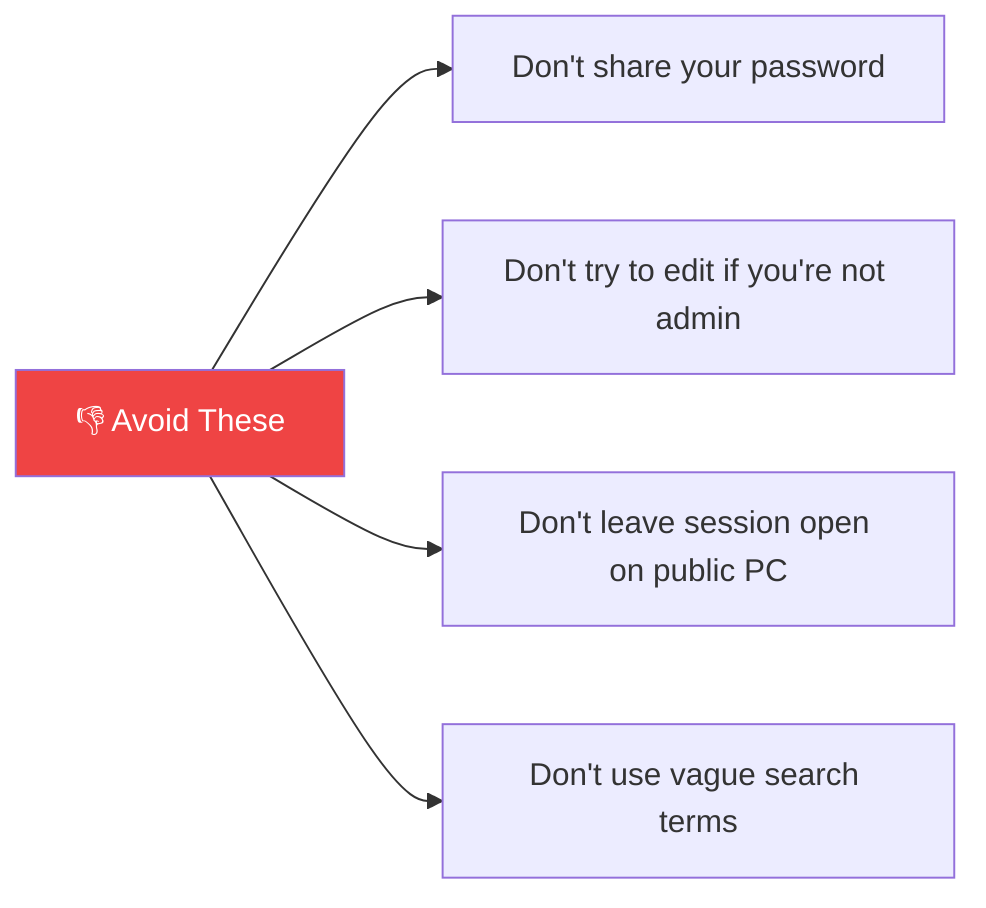
```mermaid
graph LR
    A[👎 Avoid These] --> B[Don't share your password]
    A --> C[Don't try to edit if you're not admin]
    A --> D[Don't leave session open on public PC]
    A --> E[Don't use vague search terms]
    
    style A fill:#ef4444,color:#fff
```

---

## 🔧 Troubleshooting Guide

### Problem: Can't Login

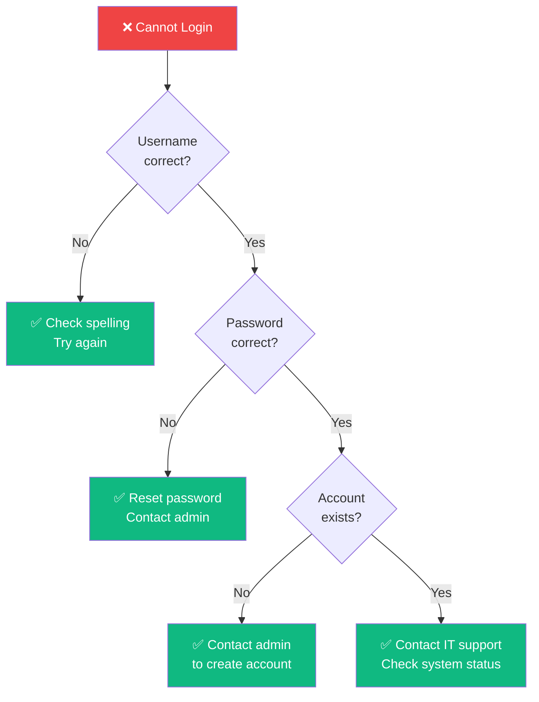
```mermaid
graph TB
    Problem[❌ Cannot Login]
    
    Problem --> Check1{Username<br/>correct?}
    Check1 -->|No| Fix1[✅ Check spelling<br/>Try again]
    Check1 -->|Yes| Check2{Password<br/>correct?}
    
    Check2 -->|No| Fix2[✅ Reset password<br/>Contact admin]
    Check2 -->|Yes| Check3{Account<br/>exists?}
    
    Check3 -->|No| Fix3[✅ Contact admin<br/>to create account]
    Check3 -->|Yes| Fix4[✅ Contact IT support<br/>Check system status]
    
    style Problem fill:#ef4444,color:#fff
    style Fix1 fill:#10b981,color:#fff
    style Fix2 fill:#10b981,color:#fff
    style Fix3 fill:#10b981,color:#fff
    style Fix4 fill:#10b981,color:#fff
```

### Problem: PDF Won't Open

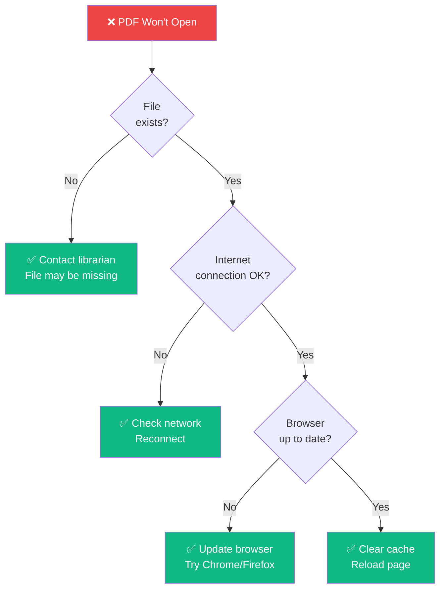
```mermaid
graph TB
    Problem[❌ PDF Won't Open]
    
    Problem --> Check1{File<br/>exists?}
    Check1 -->|No| Fix1[✅ Contact librarian<br/>File may be missing]
    Check1 -->|Yes| Check2{Internet<br/>connection OK?}
    
    Check2 -->|No| Fix2[✅ Check network<br/>Reconnect]
    Check2 -->|Yes| Check3{Browser<br/>up to date?}
    
    Check3 -->|No| Fix3[✅ Update browser<br/>Try Chrome/Firefox]
    Check3 -->|Yes| Fix4[✅ Clear cache<br/>Reload page]
    
    style Problem fill:#ef4444,color:#fff
    style Fix1 fill:#10b981,color:#fff
    style Fix2 fill:#10b981,color:#fff
    style Fix3 fill:#10b981,color:#fff
    style Fix4 fill:#10b981,color:#fff
```

---

## 📚 Summary

### What You Learned

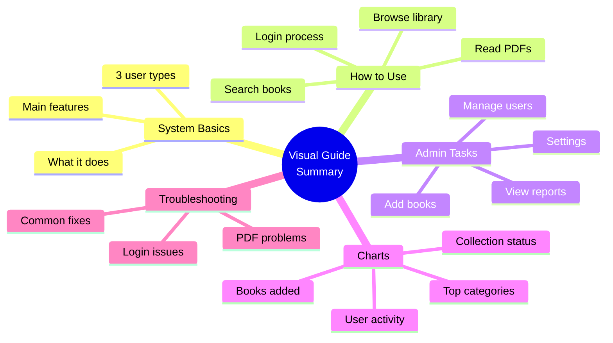
```mermaid
mindmap
  root((Visual Guide<br/>Summary))
    System Basics
      3 user types
      Main features
      What it does
    How to Use
      Login process
      Search books
      Read PDFs
      Browse library
    Admin Tasks
      Add books
      Manage users
      View reports
      Settings
    Charts
      Collection status
      Top categories
      User activity
      Books added
    Troubleshooting
      Login issues
      PDF problems
      Common fixes
```

---

## 🎓 Next Steps

### For Users
1. 🔐 Get your login credentials from admin
2. 🌐 Access the system at your library's URL
3. 🔍 Try searching for a book
4. 📖 Open and read a PDF document

### For Administrators
1. 📚 Review the admin workflow section
2. ➕ Practice adding a test book
3. 👥 Create user accounts for your team
4. 📊 Explore all four dashboard charts

### For IT Support
1. 🔧 Review the system architecture
2. 💾 Understand database structure
3. 🌐 Configure network access
4. 📋 Monitor system performance

---

**🎉 You're now ready to use the Digital Library Management System!**

*Easy to understand, easy to use!* ✨

---

*Visual Guide Version: 1.0*  
*Created: 2025*  
*For: Digital Library Management System*
