```mermaid
pie title "Books in Our Library"
    "Available for Borrowing ✅" : 15750
    "Currently on Loan 📤" : 1250
```

# 🎨 Digital Library System - Visual Guide
## Easy-to-Understand Flowcharts & Diagrams

---

## 📊 Quick Navigation

- [🎯 System at a Glance](#system-at-a-glance)
- [👤 How Users Interact](#how-users-interact)
- [👨‍💼 How Admins Work](#how-admins-work)
- [📈 Understanding the Charts](#understanding-the-charts)
- [🌐 How the System Works](#how-the-system-works)

---

## 🎯 System at a Glance

### What Does This System Do?

```mermaid
graph LR
    A[📚 17,000+ Books] --> B[💾 Digital Library<br/>Management System]
    B --> C[👥 Multiple Users<br/>on LAN]
    
    B --> D[📊 Track Everything]
    B --> E[🔍 Easy Search]
    B --> F[📄 Read PDFs]
    B --> G[📈 View Stats]
    
    style B fill:#3b82f6,color:#fff,stroke:#1e40af,stroke-width:3px
    style A fill:#10b981,color:#fff
    style C fill:#f59e0b,color:#fff
    style D fill:#8b5cf6,color:#fff
    style E fill:#ec4899,color:#fff
    style F fill:#06b6d4,color:#fff
    style G fill:#f43f5e,color:#fff
```



### Three Types of Users

```mermaid
graph TD
    System[🏢 Library System]
    
    System --> Admin[👨‍💼 ADMIN<br/>Full Control]
    System --> Petugas[👷 PETUGAS<br/>Manage Books]
    System --> User[👤 USER<br/>Read Only]
    
    Admin --> A1[✅ Everything]
    Admin --> A2[✅ Add/Edit/Delete]
    Admin --> A3[✅ See All Reports]
    Admin --> A4[✅ Manage Users]
    
    Petugas --> P1[✅ Add/Edit Books]
    Petugas --> P2[✅ Manage Categories]
    Petugas --> P3[❌ Cannot Edit Users]
    
    User --> U1[✅ Browse Books]
    User --> U2[✅ Read PDFs]
    User --> U3[❌ Cannot Edit Anything]
    
    style System fill:#3b82f6,color:#fff
    style Admin fill:#8b5cf6,color:#fff
    style Petugas fill:#f59e0b,color:#fff
    style User fill:#10b981,color:#fff
```



---

## 👤 How Users Interact

### Step-by-Step: What a Regular User Does

```mermaid
graph TB
    Start([👤 User Starts]) --> Step1[1️⃣ Open Browser<br/>Go to Library Website]
    
    Step1 --> Step2[2️⃣ Login Screen<br/>Enter username & password]
    
    Step2 --> Check1{✅ Correct?}
    Check1 -->|❌ No| Step2
    Check1 -->|✅ Yes| Step3[3️⃣ See Dashboard<br/>View statistics]
    
    Step3 --> Choice[What to do?]
    
    Choice --> Option1[🔍 Search for a Book]
    Choice --> Option2[📂 Browse by Category]
    Choice --> Option3[📍 Browse by Location]
    
    Option1 --> Find[📖 Found the Book]
    Option2 --> Find
    Option3 --> Find
    
    Find --> View[👁️ View Book Details<br/>Title, Author, etc.]
    
    View --> Check2{📄 PDF Available?}
    Check2 -->|✅ Yes| Open[📱 Open PDF Viewer<br/>Read in Browser]
    Check2 -->|❌ No| Info[ℹ️ See Book Information<br/>Location, Status]
    
    Open --> Read[📖 Reading the Document]
    Info --> Done
    Read --> Done([✅ Done])
    
    style Start fill:#10b981,color:#fff
    style Step1 fill:#3b82f6,color:#fff
    style Step2 fill:#3b82f6,color:#fff
    style Step3 fill:#3b82f6,color:#fff
    style Read fill:#10b981,color:#fff
    style Done fill:#10b981,color:#fff
```



### User's Main Features


---

## 👨‍💼 How Admins Work

### Complete Admin Workflow

```mermaid
graph TB
    AdminStart([👨‍💼 Admin Logs In]) --> Dashboard[🎯 Admin Dashboard<br/>See Everything]
    
    Dashboard --> MainChoice{What needs to be done?}
    
    MainChoice --> Books[📚 Manage Books]
    MainChoice --> Users[👥 Manage Users]
    MainChoice --> Settings[⚙️ Manage Settings]
    MainChoice --> Reports[📊 View Reports]
    
    Books --> BookChoice{Book Action?}
    BookChoice --> AddBook[➕ Add New Book<br/>Fill form, upload PDF]
    BookChoice --> EditBook[✏️ Edit Existing Book<br/>Update details]
    BookChoice --> DeleteBook[🗑️ Delete Book<br/>Remove from system]
    
    Users --> UserChoice{User Action?}
    UserChoice --> AddUser[➕ Add New User<br/>Set username, password, role]
    UserChoice --> EditUser[✏️ Edit User<br/>Change details, role]
    UserChoice --> DeleteUser[🗑️ Delete User<br/>Remove access]
    
    Settings --> SettingChoice{Setting Type?}
    SettingChoice --> Categories[🏷️ Manage Categories<br/>Add/Edit/Delete]
    SettingChoice --> Locations[📍 Manage Locations<br/>Add/Edit/Delete shelves]
    
    Reports --> ReportChoice{Report Type?}
    ReportChoice --> ViewCharts[📈 View Analytics<br/>4 beautiful charts]
    ReportChoice --> Export[📥 Export Data<br/>Generate reports]
    
    AddBook --> Save1[💾 Save to Database]
    EditBook --> Save1
    AddUser --> Save2[💾 Save User]
    EditUser --> Save2
    Categories --> Save3[💾 Save Settings]
    Locations --> Save3
    
    Save1 --> Success([✅ Changes Saved])
    Save2 --> Success
    Save3 --> Success
    DeleteBook --> Success
    DeleteUser --> Success
    ViewCharts --> Success
    Export --> Success
    
    style AdminStart fill:#8b5cf6,color:#fff
    style Dashboard fill:#3b82f6,color:#fff
    style Success fill:#10b981,color:#fff
```



### Admin Dashboard - What They See

```mermaid
graph TB
    subgraph Dashboard["🎯 ADMIN DASHBOARD VIEW"]
        subgraph Stats["📊 Quick Statistics (Top Cards)"]
            S1[📚 Total Books<br/>17,000]
            S2[✅ Available<br/>15,750]
            S3[📤 On Loan<br/>1,250]
            S4[🏷️ Categories<br/>24]
        end
        
        subgraph Charts["📈 Four Analytics Charts"]
            C1[🍩 Collection Status<br/>Doughnut Chart]
            C2[📊 Top Categories<br/>Bar Chart]
            C3[👥 User Activity<br/>Line Chart]
            C4[📚 Books Added<br/>Bar Chart]
        end
        
        subgraph Actions["⚡ Quick Actions"]
            A1[➕ Add Book]
            A2[👥 Manage Users]
            A3[📋 View Reports]
            A4[⚙️ Settings]
        end
    end
    
    Stats --> Charts
    Charts --> Actions
    
    style Dashboard fill:#f8fafc,stroke:#3b82f6,stroke-width:2px
    style Stats fill:#dbeafe
    style Charts fill:#fef3c7
    style Actions fill:#dcfce7
```



---

## 📈 Understanding the Charts

### Chart 1: Collection Status (Doughnut)

**What it looks like:**



**What it tells you:**
- ✅ Green part = Books you can borrow right now
- 🟡 Yellow part = Books someone else is reading
- 🎯 Quick view of library availability

---

### Chart 2: Top Categories (Bar)

**What it looks like:**


**What it tells you:**
- 📊 Which categories have the most books
- 📚 What type of library this is
- 🎯 Collection strengths and focus areas

---

### Chart 3: Monthly User Activity (Line)

**What it looks like:**


**What it tells you:**
- 👥 How library usage is growing
- 📈 Trend: Going up = More people using it
- 📅 Peak months vs slow months
- 🎯 Library popularity over time

**Real Example:**
- January: 45 people used the library
- June: 105 people used the library
- **Result:** Usage increased by 133%! 🎉

---

### Chart 4: Books Added by Category (Bar)

**What it looks like:**


**What it tells you:**
- 📚 Which categories are growing
- 👨‍💼 What admins are adding to the library
- 📈 Recent collection development
- 🎯 Focus areas for new acquisitions

---

## 🌐 How the System Works

### Complete System Flow


### How Data Flows

```mermaid
sequenceDiagram
    participant User as 👤 User PC
    participant Browser as 🌐 Browser
    participant Server as 🖥️ Server
    participant DB as 🗄️ Database
    participant Files as 📁 PDF Files
    
    User->>Browser: 1. Open website
    Browser->>Server: 2. Request page
    Server->>Browser: 3. Send login page
    
    User->>Browser: 4. Enter username/password
    Browser->>Server: 5. Send credentials
    Server->>DB: 6. Check user
    DB->>Server: 7. User verified ✅
    Server->>Browser: 8. Send dashboard
    
    User->>Browser: 9. Search for book
    Browser->>Server: 10. Search request
    Server->>DB: 11. Find books
    DB->>Server: 12. Return results
    Server->>Browser: 13. Show books
    
    User->>Browser: 14. Click to open PDF
    Browser->>Server: 15. Request PDF
    Server->>Files: 16. Get PDF file
    Files->>Server: 17. Send file
    Server->>Browser: 18. Stream PDF
    Browser->>User: 19. Display PDF 📄
```



---

## 🔄 Common User Scenarios

### Scenario 1: Student Looking for Engineering Book


### Scenario 2: Librarian Adding New Books


---

## 📱 Using the System: Step-by-Step Pictures

### For Regular Users

#### Step 1: Login
```
┌─────────────────────────────────┐
│   📚 Library Management System  │
│                                 │
│   Username: [____________]      │
│   Password: [____________]      │
│                                 │
│         [  LOGIN  ]             │
└─────────────────────────────────┘
```

#### Step 2: Dashboard
```
┌─────────────────────────────────────────────────┐
│ 🏠 Dashboard                         👤 User    │
├─────────────────────────────────────────────────┤
│  📊 Statistics:                                 │
│  ┌──────┐ ┌──────┐ ┌──────┐ ┌──────┐         │
│  │17000 │ │15750 │ │ 1250 │ │  24  │         │
│  │Books │ │Avail │ │ Loan │ │ Cat. │         │
│  └──────┘ └──────┘ └──────┘ └──────┘         │
│                                                 │
│  📈 Charts showing usage...                    │
└─────────────────────────────────────────────────┘
```

#### Step 3: Browse Books
```
┌─────────────────────────────────────────────────┐
│ 📚 Document Repository                          │
├─────────────────────────────────────────────────┤
│  Search: [engineering______] 🔍                 │
│  Category: [All ▼] Location: [All ▼]          │
├─────────────────────────────────────────────────┤
│  Title                    | Category | Status  │
│  ──────────────────────────────────────────── │
│  📕 Engineering Basics    | Eng.     | ✅ Avail│
│  📗 Advanced Mechanics    | Eng.     | ✅ Avail│
│  📘 Thermodynamics 101    | Eng.     | 📤 Loan │
└─────────────────────────────────────────────────┘
```

#### Step 4: Read PDF
```
┌─────────────────────────────────────────────────┐
│ 📄 PDF Viewer - Engineering Basics             │
├─────────────────────────────────────────────────┤
│  [<] Page 1 of 250 [>]         [🔍-] [🔍+]    │
├─────────────────────────────────────────────────┤
│                                                 │
│     ENGINEERING BASICS                          │
│     Chapter 1: Introduction                     │
│                                                 │
│     This book covers fundamental concepts...    │
│                                                 │
└─────────────────────────────────────────────────┘
```

---

### For Administrators

#### Admin Dashboard
```
┌──────────────────────────────────────────────────────┐
│ 🎯 Admin Dashboard                    👨‍💼 Admin      │
├──────────────────────────────────────────────────────┤
│  📊 Statistics & 4 Charts:                           │
│  ┌────────┐┌────────┐┌────────┐┌────────┐          │
│  │ Total  ││Available││On Loan ││Categor.│          │
│  │ 17,000 ││ 15,750  ││ 1,250  ││   24   │          │
│  └────────┘└────────┘└────────┘└────────┘          │
│                                                      │
│  ┌──────────────┐ ┌──────────────┐                 │
│  │ 🍩 Collection│ │ 📊 Top       │                 │
│  │    Status    │ │   Categories │                 │
│  └──────────────┘ └──────────────┘                 │
│                                                      │
│  ┌──────────────┐ ┌──────────────┐                 │
│  │ 👥 User      │ │ 📚 Books by  │                 │
│  │   Activity   │ │   Category   │                 │
│  └──────────────┘ └──────────────┘                 │
│                                                      │
│  Quick Actions:                                      │
│  [➕ Add Book] [👥 Users] [📋 Reports] [⚙️ Settings]│
└──────────────────────────────────────────────────────┘
```

#### Add New Book Form
```
┌──────────────────────────────────────────────────┐
│ ➕ Add New Book                                   │
├──────────────────────────────────────────────────┤
│  Title:      [________________________]          │
│  Author:     [________________________]          │
│  Publisher:  [________________________]          │
│  Category:   [Select Category ▼      ]          │
│  Location:   [Select Shelf/Rack ▼   ]          │
│  Department: [________________________]          │
│  PDF File:   [Choose File] no file chosen       │
│                                                   │
│          [Cancel]  [💾 Save Book]               │
└──────────────────────────────────────────────────┘
```

---

## 🎯 Quick Tips for Users

### Do's ✅

```mermaid
graph LR
    A[👍 Good Practices] --> B[Use search to find books quickly]
    A --> C[Filter by category for better results]
    A --> D[Check PDF availability before clicking]
    A --> E[Logout when finished]
    A --> F[Use specific keywords when searching]
    
    style A fill:#10b981,color:#fff
```



### Don'ts ❌


---

## 🔧 Troubleshooting Guide

### Problem: Can't Login

```mermaid
graph TB
    Problem[❌ Cannot Login]
    
    Problem --> Check1{Username<br/>correct?}
    Check1 -->|No| Fix1[✅ Check spelling<br/>Try again]
    Check1 -->|Yes| Check2{Password<br/>correct?}
    
    Check2 -->|No| Fix2[✅ Reset password<br/>Contact admin]
    Check2 -->|Yes| Check3{Account<br/>exists?}
    
    Check3 -->|No| Fix3[✅ Contact admin<br/>to create account]
    Check3 -->|Yes| Fix4[✅ Contact IT support<br/>Check system status]
    
    style Problem fill:#ef4444,color:#fff
    style Fix1 fill:#10b981,color:#fff
    style Fix2 fill:#10b981,color:#fff
    style Fix3 fill:#10b981,color:#fff
    style Fix4 fill:#10b981,color:#fff
```



### Problem: PDF Won't Open

```mermaid
graph TB
    Problem[❌ PDF Won't Open]
    
    Problem --> Check1{File<br/>exists?}
    Check1 -->|No| Fix1[✅ Contact librarian<br/>File may be missing]
    Check1 -->|Yes| Check2{Internet<br/>connection OK?}
    
    Check2 -->|No| Fix2[✅ Check network<br/>Reconnect]
    Check2 -->|Yes| Check3{Browser<br/>up to date?}
    
    Check3 -->|No| Fix3[✅ Update browser<br/>Try Chrome/Firefox]
    Check3 -->|Yes| Fix4[✅ Clear cache<br/>Reload page]
    
    style Problem fill:#ef4444,color:#fff
    style Fix1 fill:#10b981,color:#fff
    style Fix2 fill:#10b981,color:#fff
    style Fix3 fill:#10b981,color:#fff
    style Fix4 fill:#10b981,color:#fff
```



---

## 📚 Summary

### What You Learned


---

## 🎓 Next Steps

### For Users
1. 🔐 Get your login credentials from admin
2. 🌐 Access the system at your library's URL
3. 🔍 Try searching for a book
4. 📖 Open and read a PDF document

### For Administrators
1. 📚 Review the admin workflow section
2. ➕ Practice adding a test book
3. 👥 Create user accounts for your team
4. 📊 Explore all four dashboard charts

### For IT Support
1. 🔧 Review the system architecture
2. 💾 Understand database structure
3. 🌐 Configure network access
4. 📋 Monitor system performance

---

**🎉 You're now ready to use the Digital Library Management System!**

*Easy to understand, easy to use!* ✨

---

*Visual Guide Version: 1.0*  
*Created: 2025*  
*For: Digital Library Management System*
